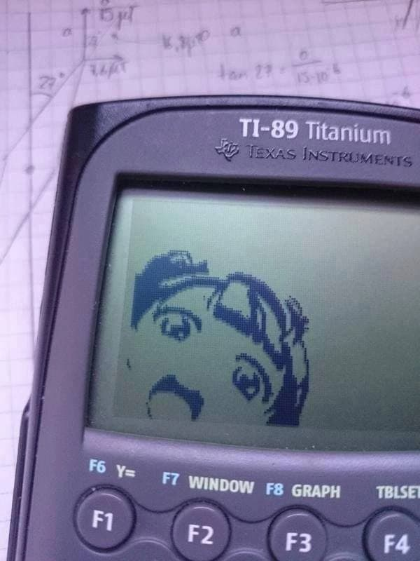

# HyKeos
This is a HyKeos:  (*I took the image from a site that did not put the author, if anyone knows who it is do not hesitate to tell me.*)

Bot designed for my server `Guiris`. But maybe some of the methods and commands will be useful for you to learn.

# Dependencies
## Virtual environment
`python -m venv .venv`

# Library
`pip install git+https://github.com/Pycord-Development/pycord` or `pip install py-cord`

## PyCord Documentacion
https://docs.pycord.dev/en/master/index.html
https://guide.pycord.dev/introduction

# Features
## Commands
### Done ✅
* `\ping`: Ping.
* `\hello`: Salutation.
* `\rnd`: Random kick the server.
* `\rnd_easy`: Random eject from the voice channel.
* `rnd_move_someone`: Random move to a random channel.
* `\move_to_cinema`: It moves people to the movies. 
    * Permitted roles:
        * @Cineasta
        * @admin
* `\move_to`: It moves people to somewhere. 
    * Permitted roles:
        * @admin
* `\roles`: Show all roles with number of who have it.
* `\reformatory`: Moves a member to the reformatory for a random amount of time. It is important to know that this member cannot be released even if Discord is closed, the only way is to restart the host.
    * Permitted roles:
        * @admin
        * @Staff Reformatory
* `\pls_rol`: Command to request a role and arrive at a channel where the administrators accept or deny the request.
* `\vote`: Perform a vote with the emojis ✅ and ❌ and after a time defined by the user, the voters will be notified. Subsequently, the roles created will be deleted.
* `\vote_custom`: Perform a vote like the previous command, but with custom emojis.
* `\food_ratings`: It makes a tour of all the messages with ratings, calculates the score of top 10 users and shows it. FIXME: Make a data structure and save the ratings in it when uploading a photo, so that the bot does not have to read the whole channel.
* `\food_ratings_custom`: Same as the previous command but with custom top and month.
* `\food_statistics_of`: Shows the average, score and meals taken by a member. FIXME: Make a structure or reuse the `\food_ratings` structure to optimize.
* `\russian_roulette`: A vote is taken by the members of a channel. Once the vote has been taken, a game of Russian Roulette is played.
    * Modes:
        * Easy: Only moves channel
        * Hard: Kick the server

### Pending 🕔
* `\add_movie`: Adding a movie to a list of movies but writing and reading from a .json
* `Music`: Play music from youtube or other plataforms.
* `Trash Channel`: A channel that deletes messages every x time and with a command.
* `Temporal Voice Channels`: Cloning temporary channels from a voice channel
* `Edit Avatars`: Edit member's avatar images

# Acknowledgments
I want to thank my friends who have made this project possible, I have learned a lot thanks to this project.